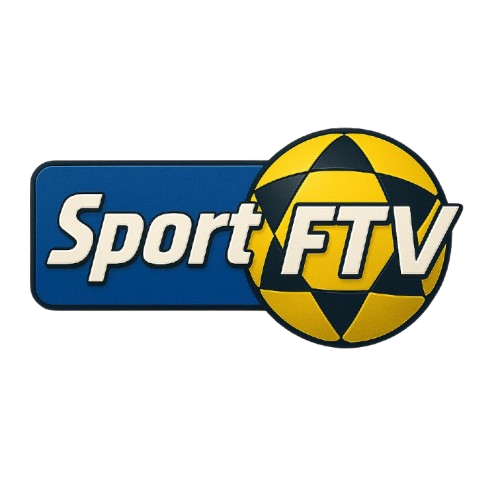

<div align="center">
  
  <h1>Sport FTV</h1>
</div>

Plataforma de vídeos para futevôlei com player personalizado e sistema de melhores momentos.

## 🚀 Tecnologias

- React + TypeScript
- Vite
- Tailwind CSS
- Framer Motion
- Firebase Hosting

## 📦 Instalação

```bash
npm install
```
## 📁 Estrutura

- `/src/pages` - Páginas da aplicação
- `/src/components` - Componentes reutilizáveis
- `/src/assets/videos` - Vídeos e thumbnails
- `/src/data` - Dados dos vídeos

## ✨ Funcionalidades

- Player de vídeo personalizado
- Cards interativos com hover effects
- Download de vídeos
- Extração automática de data/hora
- Design responsivo